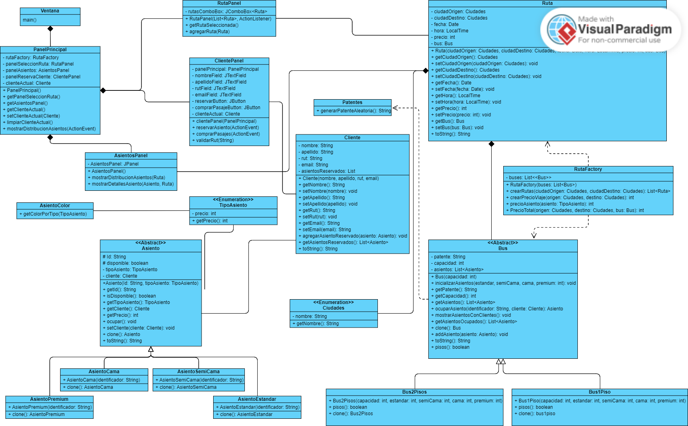
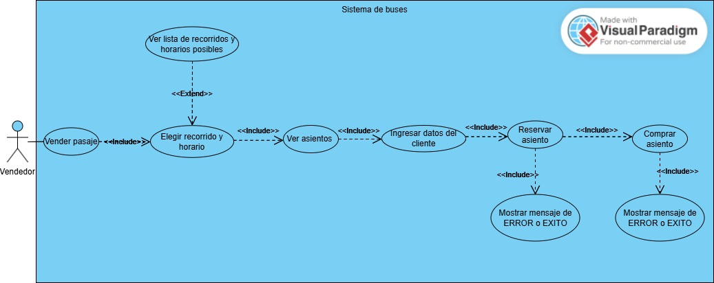

# Proyecto Final: Sistema de reserva de asientos de autobús.

### Integrantes del grupo (1)
- Joaquín Andres Arriagada Beltran
- Benjamín Nicolás Díaz Villalobos
- Gabriela Escalona Weldt

### Diagrama de clases UML

### Diagrama de casos de uso
  
## Patrones utilizados 
- **Factory**: Este patron se utilizó para 
crear rutas de manera flexible y centralizada en la clase RutaFactory. 
Este patrón permite encapsular la lógica de creación de objetos (Ruta) y 
manejar diferentes configuraciones (como ciudades de origen y destino, precios,
y buses asociados) sin exponer la lógica de instanciación directamente en la clase principal.
  - ***Ventaja***: Si necesitamos cambiar cómo se crean las rutas, solo debemos modificar 
RutaFactory en lugar de actualizar múltiples partes del programa.  

- **Prototype** :Este patron se utilizó para clonar objetos existentes (buses) 
en lugar de crear nuevas instancias desde cero. Esto es útil porque los buses pueden 
tener configuraciones complejas (como la distribución de asientos),
y clonarlos es más eficiente que recrearlos manualmente.
    - ***Ventaja*** : Ahorramos tiempo y recursos al no reconstruir manualmente los buses para cada ruta.

### Interfaz 

### Decisiones tomadas durante el proyecto
- **Uso del Patrón Factory para la creación de rutas:** Se decidió implementar el patrón Factory en la clase
RutaFactory para centralizar y simplificar la creación de rutas con diferentes configuraciones de ciudades, 
precios y buses. Esto permitió reducir el acoplamiento entre las clases y facilitó la escalabilidad del proyecto,
como la adición de nuevas rutas o configuraciones de buses sin modificar otras partes del código.

- **Separación de la interfaz gráfica en paneles:** Optamos por dividir la interfaz gráfica en paneles 
(RutaPanel, AsientosPanel, ClientePanel, y PanelPrincipal) para mejorar la organización del código, 
mantener la responsabilidad única de cada componente y facilitar el mantenimiento y la lectura del programa.

- **Uso del Patrón Prototype para clonar buses:** Decidimos utilizar el patrón Prototype para clonar objetos Bus, 
asegurando que cada ruta tuviera su propia copia independiente de los buses. Esto evitó conflictos al modificar buses 
compartidos y redujo el esfuerzo de inicializar configuraciones repetidamente.  

- **Interacción basada en eventos en la interfaz gráfica:** Se eligió un diseño basado en eventos (listeners) para manejar 
las acciones del usuario en la interfaz gráfica, como la selección de rutas y la reserva de asientos. Esto mejoró la 
interactividad del sistema.  
### Problemas encontrados y autocrítica

- **Falta de planificación inicial sobre la estructura del proyecto:** Durante las primeras semanas, no definimos bien 
cómo estructurar las clases de la interfaz gráfica. Esto llevó a que al principio desarrollaramos toda la interfaz en una sola clase , 
lo que complicó el mantenimiento y forzó una posterior refactorización para separar responsabilidades en paneles..

- **Problemas al refactorizar interfaz** : Al separar la interfaz en los distintos paneles nos encontramos con distintos problemas,
como que el boton de reserva no funcionaba bien ,lo cual nos retraso temporalmente.

- **Dificultades con los plazos:** Debido a la carga academica y problemas de organización no retrasamos, sabemos que con una mayor 
antelación y dialogo podriamos entregar un trabajo mas completo.

